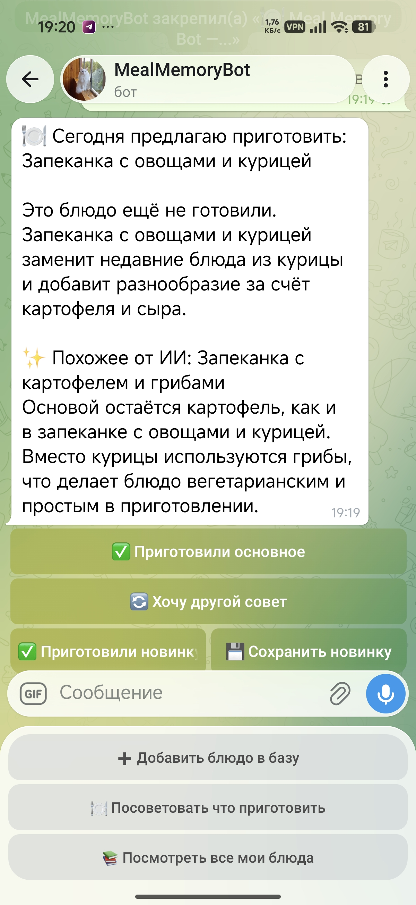
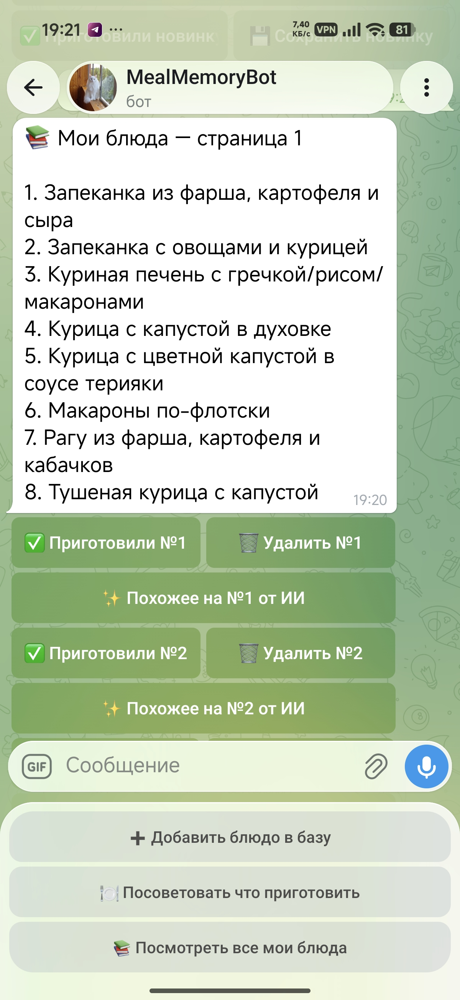
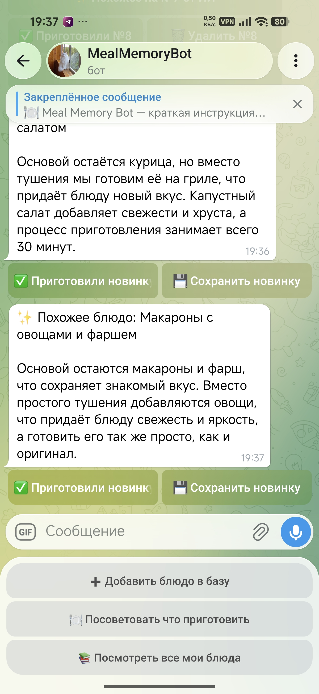
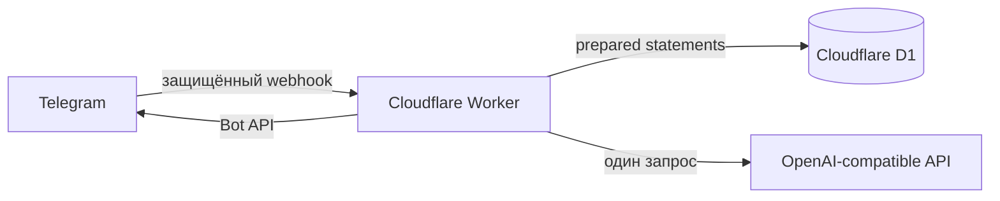

# Meal Memory Bot

Личный Telegram-бот для небольшого общего каталога домашних блюд. Он помнит
подтверждённые приготовления, возвращает в рацион давно забытые варианты и при
необходимости дополняет детерминированный выбор одной идеей от ИИ.

Проект уже развёрнут на Cloudflare Workers и прошёл ручную проверку основных
production-сценариев. Бот рассчитан на двух пользователей из allowlist, но число
разрешённых Telegram ID задаётся конфигурацией.

## Что умеет бот

- добавлять блюдо по названию и необязательному описанию;
- советовать одно из давно не приготовленных блюд;
- предлагать похожую новинку через OpenAI-compatible API;
- сохранять новинку отдельно или сразу отмечать её приготовленной;
- показывать каталог с пагинацией, ручной отметкой приготовления и полным
  удалением;
- продолжать выдавать полезный совет из D1 при ошибке или таймауте ИИ.

Рекомендация сама по себе не меняет историю: `cook_event` создаётся только после
явного нажатия кнопки «Приготовили». ИИ получает ограниченный шорт-лист и не
может выбрать произвольное блюдо из каталога.

## Интерфейс

<table>
  <tr>
    <td width="33%"></td>
    <td width="33%"></td>
    <td width="33%"></td>
  </tr>
  <tr>
    <td align="center">Рекомендация</td>
    <td align="center">Каталог</td>
    <td align="center">Похожая новинка</td>
  </tr>
</table>

## Архитектура и стек



- TypeScript в strict-режиме;
- Cloudflare Workers modules syntax и D1;
- grammY в webhook-режиме;
- Zod для runtime-валидации AI-контракта;
- нативный `fetch` без SDK конкретного AI-провайдера;
- Vitest и официальный Cloudflare Workers test pool;
- Wrangler и npm.

Код разделён на Telegram handlers, application use cases, доменную логику и
инфраструктурные адаптеры. SQL находится только в `src/infrastructure/d1` и
миграциях, а HTTP-детали ИИ — только в `src/infrastructure/ai`.

## Документация

- [USER_GUIDE.md](USER_GUIDE.md) — краткая инструкция для пользователей бота;
- [SPEC.md](SPEC.md) — продуктовые требования, архитектура и AI-контракт;
- [ROADMAP.md](ROADMAP.md) — публичный план и текущее состояние;
- [AGENTS.md](AGENTS.md) — инженерные ограничения и Definition of Done.

Разработка велась specification-first короткими вертикальными срезами: сначала
полезный сценарий без ИИ, затем внешние интеграции, production-проверка и
стабилизация по результатам code review и ручного тестирования.

## Требования для запуска

- актуальная LTS-версия Node.js и npm;
- аккаунт Cloudflare с доступом к Workers и D1;
- Telegram-бот, созданный через BotFather;
- API-ключ, base URL и model ID OpenAI-compatible провайдера.

## Локальный запуск

1. Установите зависимости:

   ```powershell
   npm ci
   ```

2. Скопируйте шаблон переменных и замените все плейсхолдеры. `.dev.vars` уже
   добавлен в `.gitignore` и не должен попадать в Git:

   ```powershell
   Copy-Item .dev.vars.example .dev.vars
   ```

   `TELEGRAM_ALLOWED_USER_IDS` — список Telegram ID через запятую. Свой ID можно
   получить командой `/id`; она возвращает только ID отправителя.

3. Создайте ignored-файл
   `src/infrastructure/ai/prompts/recommendation.local.ts`. Он должен
   экспортировать две строки:

   ```ts
   export const recommendationSystemPrompt = "ваш system prompt обычного совета";
   export const similarRecommendationSystemPrompt = "ваш system prompt похожей новинки";
   ```

   Требования к обоим prompt описаны в [разделе 9 спецификации](SPEC.md#9-контракт-с-ии).
   В частности, prompt должен требовать только JSON, считать входные строки
   недоверенными данными и не делать точных медицинских или нутриентных выводов.
   Настоящее содержимое prompt намеренно не хранится в репозитории.

4. Примените D1-миграции к локальной базе и запустите Worker:

   ```powershell
   npx wrangler d1 migrations apply meal-memory --local
   npm run dev
   ```

5. Проверьте `http://localhost:8787/health`. Локальный Worker не получает
   Telegram webhook из интернета без отдельного HTTPS-туннеля; для обычной
   эксплуатации настройте webhook после production-деплоя.

## Проверки

```powershell
npm run typecheck
npm run lint
npm test
```

Тесты используют локальную D1 и моки внешних границ; обращения к настоящим
Telegram Bot API и AI API не выполняются.

## Production-деплой

1. Авторизуйте Wrangler, создайте D1 и перенесите выданный `database_id` в
   binding `DB` файла `wrangler.jsonc`:

   ```powershell
   npx wrangler login
   npx wrangler d1 create meal-memory
   ```

2. Добавьте production secrets. Команды запрашивают значения интерактивно и не
   записывают их в репозиторий:

   ```powershell
   npx wrangler secret put TELEGRAM_BOT_TOKEN
   npx wrangler secret put TELEGRAM_WEBHOOK_SECRET
   npx wrangler secret put TELEGRAM_ALLOWED_USER_IDS
   npx wrangler secret put AI_API_KEY
   npx wrangler secret put AI_BASE_URL
   npx wrangler secret put AI_MODEL
   ```

   `AI_BASE_URL` и `AI_MODEL` хранятся как secrets, чтобы публичный
   `wrangler.jsonc` не раскрывал выбранные endpoint и модель. API-ключи и токены
   нельзя помещать в `vars`.

3. Проверьте несекретные AI-параметры в `wrangler.jsonc`, примените миграции и
   разверните Worker:

   ```powershell
   npx wrangler d1 migrations apply meal-memory --remote
   npm run deploy
   ```

   Текущая проверенная конфигурация использует `AI_TIMEOUT_MS=20000`,
   `AI_RESPONSE_FORMAT=json_object` и `AI_TEMPERATURE=0.2`. Ответ дополнительно
   проходит Zod- и прикладную валидацию. При смене модели заново проверьте
   обычный и похожий AI-сценарии с полным payload.

4. Настройте Telegram webhook на выданный HTTPS URL Worker. Значение
   `secret_token` должно совпадать с `TELEGRAM_WEBHOOK_SECRET`, а
   `allowed_updates` — включать только `message` и `callback_query`:

   ```text
   POST https://api.telegram.org/bot<TELEGRAM_BOT_TOKEN>/setWebhook
   url=https://<worker-host>/telegram/webhook
   secret_token=<TELEGRAM_WEBHOOK_SECRET>
   allowed_updates=["message","callback_query"]
   ```

   После настройки проверьте `GET /health`, Telegram `getWebhookInfo` и сценарии
   из [пользовательской инструкции](USER_GUIDE.md). Для первого чистого запуска
   при необходимости можно передать `drop_pending_updates=true`.

## Конфигурация

| Переменная | Назначение |
| --- | --- |
| `TELEGRAM_BOT_TOKEN` | токен Telegram-бота |
| `TELEGRAM_WEBHOOK_SECRET` | secret token входящего webhook |
| `TELEGRAM_ALLOWED_USER_IDS` | разрешённые Telegram ID через запятую |
| `AI_API_KEY` | ключ AI-провайдера |
| `AI_BASE_URL` | base URL OpenAI-compatible API |
| `AI_MODEL` | model ID провайдера |
| `AI_TIMEOUT_MS` | таймаут AI-запроса, по умолчанию 20 000 мс, максимум 25 000 мс |
| `AI_RESPONSE_FORMAT` | `json_object` или `json_schema` |
| `AI_TEMPERATURE` | температура генерации от 0 до 2 |
| `AI_REASONING_EFFORT` | необязательное значение `low` для совместимых моделей |
| `APP_ENV` | `development` или `production` |

## Приватность и эксплуатация

- Доступ к бизнес-функциям ограничен allowlist.
- Telegram ID и username не передаются AI-провайдеру. Названия и необязательные
  описания блюд передаются как недоверенные данные, необходимые для совета.
- В логах нет токенов, полного prompt и содержимого личных заметок.
- `.dev.vars`, `.env`, локальный prompt и дампы D1 исключены из Git.
- Проект не выдаёт медицинских рекомендаций и не рассчитывает точные КБЖУ.

Для резервного копирования используйте экспорт D1 через Wrangler и храните дамп
вне публичного репозитория.

## Контакты

Telegram: [@Zorin_4](https://t.me/Zorin_4) · Email: [workzor@bk.ru](mailto:workzor@bk.ru)

## Лицензия

Проект распространяется по [лицензии MIT](LICENSE): код можно использовать,
изменять и распространять, включая коммерческие проекты, при сохранении текста
лицензии и уведомления об авторских правах.
