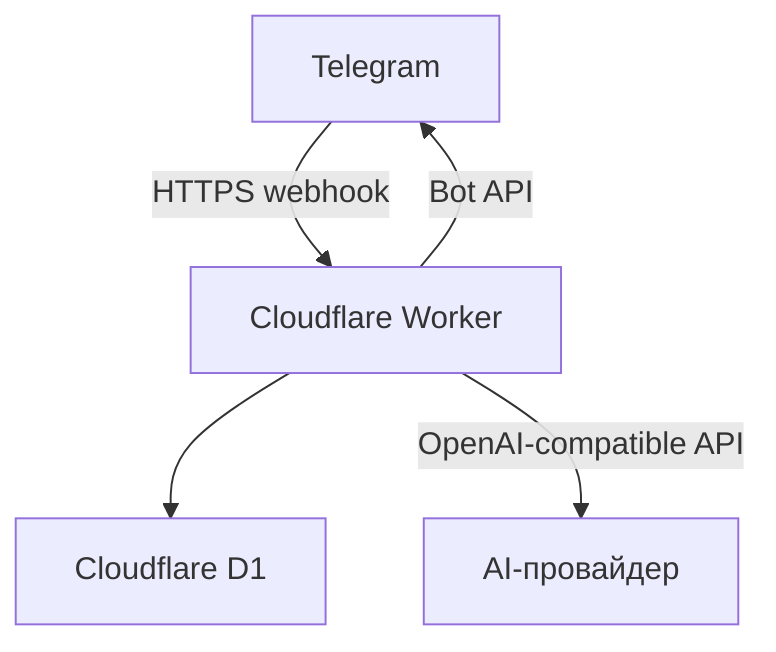

# Meal Memory Bot — спецификация MVP

Статус: MVP реализован и развёрнут, идёт эксплуатационная проверка
Дата: 2026-07-21, обновлено 2026-08-14
Рабочее название: **Meal Memory Bot**

## 1. Краткое описание

Личный Telegram-бот для двух человек, который хранит знакомые блюда, помнит историю приготовления и помогает решить, что приготовить сегодня.

У бота три основные функции:

1. **Добавить блюдо** в общий пул.
2. **Посоветовать блюдо** с приоритетом давно не приготовленных вариантов.
3. **Управлять каталогом** и получать похожую новую идею для выбранного блюда.

Один вызов ИИ дополняет детерминированный алгоритм: выбирает наиболее уместное блюдо из безопасного шорт-листа, объясняет выбор и предлагает одну похожую, простую новинку, которой ещё нет в базе.

## 2. Цели MVP

- Убрать ежедневные «муки выбора».
- Не забывать блюда, которые пользователи уже умеют готовить.
- Возвращать в рацион давно не приготовленные блюда.
- Постепенно расширять пул похожими и несложными блюдами.
- Мягко повышать разнообразие рациона без подсчёта граммов, порций и точной калорийности.
- Работать постоянно вне локального компьютера и укладываться в бесплатные лимиты инфраструктуры.

## 3. Что не входит в MVP

- Веб-интерфейс или мобильное приложение.
- Регистрация, профили и публичный доступ.
- Полноценный планировщик меню на неделю.
- Список покупок, склад продуктов и контроль остатков.
- Подробные рецепты и пошаговый режим готовки.
- Точный подсчёт калорий, БЖУ, витаминов, минералов и размера порций.
- Медицинские или диетологические рекомендации.
- Векторная БД, RAG, несколько ИИ-агентов, очереди и микросервисы.
- NestJS, Express, отдельный frontend и отдельный сервер БД.

## 4. Принятые решения

| Область | Решение |
| --- | --- |
| Интерфейс | Telegram-бот с постоянной клавиатурой |
| Пользователи | Только два Telegram user ID из allowlist |
| Язык | Русский |
| Runtime | Cloudflare Workers |
| Получение событий | Telegram webhook, не long polling |
| База данных | Cloudflare D1 (SQLite) |
| Язык разработки | TypeScript в strict-режиме |
| Telegram SDK | grammY |
| ИИ | Модель через OpenAI-compatible API выбранного провайдера |
| Вызов ИИ | Нативный `fetch`, без привязки к SDK конкретного провайдера |
| Проверка ИИ-ответа | Zod + прикладная валидация допустимых ID и дублей |
| Тесты | Vitest + Cloudflare Workers test pool |
| Деплой | Wrangler |
| Пакетный менеджер | npm |

Все параметры ИИ должны задаваться окружением. Смена провайдера или модели не должна требовать изменения бизнес-логики.

## 5. Почему выбран Cloudflare Workers + D1

Для двух пользователей это минимальная архитектура из одного runtime и одной встроенной БД:



Актуальные на дату спецификации бесплатные лимиты Cloudflare значительно выше ожидаемой нагрузки: Workers — 100 000 запросов в день; D1 — 5 млн прочитанных и 100 000 записанных строк в день, до 5 ГБ суммарного хранения. Ожидание сетевого `fetch()` не считается CPU-временем Worker. Для личного бота нагрузка будет составлять единицы или десятки запросов в день.

### Сравнение альтернатив

| Вариант | Решение | Причина |
| --- | --- | --- |
| GitHub Pages | Не подходит | Только статическая раздача; негде безопасно хранить токены, выполнять webhook и писать в БД |
| Vercel | Допустимый запасной вариант | Поддерживает webhook, но нужна отдельная БД и получается два сервиса вместо одного |
| Supabase | Не выбран | Удобен, но малоактивный Free-проект может быть автоматически приостановлен |
| VPS / Docker | Не выбран | Работает, но требует администрирования и постоянной оплаты; для такого бота избыточен |
| Yandex Cloud Functions + YDB | Российский запасной вариант | Меньше географических рисков, но настройка IAM, API Gateway и YDB заметно сложнее |

Cloudflare — иностранная платформа. На бесплатном тарифе российская карта не требуется, а пользователи общаются только с Telegram. Если доступ к панели или политика платформы изменятся, прикладные слои должны позволить перенести webhook и репозиторий данных без переписывания доменной логики.

## 6. Пользовательские сценарии

### 6.1. `/start`

Бот:

- проверяет Telegram user ID;
- для разрешённого пользователя показывает краткую инструкцию по всем действиям бота;
- выводит три постоянные кнопки:
  - `➕ Добавить блюдо в базу`;
  - `🍽 Посоветовать что приготовить`;
  - `📚 Посмотреть все мои блюда`.
- сбрасывает незавершённое состояние добавления блюда;
- закрепляет инструкцию без уведомления и при повторном `/start` по возможности
  переиспользует сохранённое сообщение, не создавая дубликат;
- если Telegram не позволил закрепить сообщение, инструкция и постоянная клавиатура всё равно остаются доступными, а ошибка безопасно логируется без содержимого сообщения.
- служебный update о закреплении, отправленный самим ботом, игнорируется без ответа об отсутствии доступа.

Неавторизованному пользователю бот отвечает нейтральным отказом и не выполняет дальнейшие операции.

### 6.2. Добавление блюда

1. Пользователь нажимает `➕ Добавить блюдо в базу`.
2. Бот переводит его в состояние `awaiting_dish` на 5 минут.
3. Бот просит прислать одно сообщение:
   - первая строка — название, обязательно;
   - остальные строки — ингредиенты или комментарий, опционально.
4. Пример:

   ```text
   Гречка с курицей
   Гречка, куриное филе, лук, морковь; готовим на сковороде
   ```

5. Бот валидирует название, нормализует его для поиска дублей и сохраняет блюдо.
6. Бот подтверждает добавление и сбрасывает состояние диалога.

Допустим и самый короткий вариант — только название. Добавление блюда не должно зависеть от доступности ИИ.

#### Валидация

- Название после `trim`: от 2 до 100 символов.
- Полное сообщение: не более 1 500 символов.
- Пустой ввод отклоняется.
- Дубликат определяется по `normalized_name`.
- Нормализация MVP: нижний регистр, `ё → е`, удаление повторных пробелов и пробелов по краям.
- Если блюдо уже существует, бот сообщает об этом, не создавая вторую запись.
- Команда `/cancel` или кнопка `Отмена` прекращает текущий ввод.
- После истечения состояния бот отвечает: `Время добавления истекло. Нажмите «➕ Добавить блюдо в базу», чтобы начать заново.`

### 6.3. Рекомендация блюда

1. Пользователь нажимает `🍽 Посоветовать что приготовить`.
2. Бот сбрасывает незавершённое добавление блюда и показывает
   `⏳ Подбираю вариант…`.
3. Если база пуста, бот предлагает сначала добавить несколько блюд.
4. Приложение формирует до пяти кандидатов, которые не готовили дольше всего.
5. Приложение передаёт ИИ только этот шорт-лист, недавнюю историю и названия блюд каталога.
6. ИИ:
   - выбирает ровно один `dishId` из шорт-листа;
   - кратко объясняет выбор;
   - предлагает одну простую похожую новинку, отсутствующую в каталоге;
   - даёт только качественный комментарий о пищевом разнообразии.
7. Приложение валидирует ответ ИИ.
8. Бот заменяет сообщение прогресса рекомендацией и inline-кнопками. Если
   редактирование недоступно, результат отправляется новым сообщением.

Пример ответа:

```text
🍽 Сегодня предлагаю приготовить: чечевичный суп

Вы давно его не готовили, а после нескольких мясных блюд бобовые добавят разнообразия источников белка и клетчатки.

✨ Похожее от ИИ: суп с нутом и овощами
Простой густой суп из доступных продуктов, около 35 минут.
```

Кнопки:

- `✅ Приготовили основное` — записывает приготовление основного блюда;
- `✅ Приготовили новинку` — добавляет новинку в пул и записывает приготовление;
- `💾 Сохранить новинку` — добавляет новинку, но не отмечает её приготовленной;
- `🔄 Хочу другой совет` — формирует следующий совет, не меняя историю приготовления.

Если ИИ не предложил валидную новинку, связанные с ней кнопки не выводятся.

### 6.4. Семантика «приготовили»

- Рекомендация сама по себе **не** обновляет `lastCookedAt`.
- Дата меняется только после явного нажатия одной из кнопок `Приготовили`.
- Источником истины является журнал `cook_events`, а не поле в таблице блюда.
- `lastCookedAt` вычисляется как максимальная дата события конкретного блюда.
- Повторное получение одного callback не должно создавать второе событие.

### 6.5. Похожее блюдо из каталога

Действие `✨ Похожее на №… от ИИ` у конкретного блюда в каталоге `📚 Посмотреть все мои блюда` — отдельный сценарий, а не рекомендация «что приготовить сегодня».

1. Пользователь выбирает знакомое блюдо в каталоге.
2. Бот сразу подтверждает callback и показывает `⏳ Ищу похожее блюдо…`.
3. Приложение передаёт ИИ выбранное блюдо как единственный допустимый контекст для похожей идеи, а также ограниченную недавнюю историю и названия активного каталога.
4. ИИ вызывается ровно один раз и предлагает одну валидную новинку, которой ещё нет в каталоге.
5. Бот заменяет сообщение прогресса новинкой и кратким объяснением сходства. Исходное блюдо не выводится как `🍽 Сегодня`, а объяснение выбора основного блюда не показывается.
6. Для новинки доступны только действия:
   - `✅ Приготовили новинку` — сохранить и создать `cook_event`;
   - `💾 Сохранить новинку` — сохранить без `cook_event`.
7. Поиск похожей идеи сам по себе не создаёт `cook_event` и не влияет на давность или историю обычных рекомендаций «что приготовить сегодня».
8. Если ИИ недоступен, вернул невалидный ответ или не предложил допустимую новинку, бот сообщает, что похожее блюдо подобрать не удалось. Исходное блюдо не используется как fallback-ответ.

Если ранее сохранённая рекомендация не содержит доступной новинки, бот отвечает: `У этого блюда нет доступного нового варианта.`

Пример ответа:

```text
✨ Похожее блюдо: тушёная курица с брокколи

Похожий простой вариант: курица тушится с овощами, но брокколи добавляет другой вкус и текстуру.
```

## 7. Алгоритм выбора давно не приготовленных блюд

Основное правило реализуется обычным кодом и SQL, а не ИИ.

1. Выбрать только активные блюда.
2. Посчитать для каждого блюда:
   - последнюю дату приготовления;
   - количество приготовлений;
   - последнюю дату рекомендации.
3. Сначала поставить блюда, которые ещё ни разу не отмечались приготовленными.
4. Остальные отсортировать по `lastCookedAt` от самой старой даты.
5. Если в базе достаточно вариантов, исключить два последних рекомендованных блюда, чтобы кнопка `Хочу другой совет` не зацикливалась.
6. Взять первые пять записей как шорт-лист.
7. При равных значениях перемешать кандидатов, чтобы результат не был навсегда фиксированным.
8. Разрешить ИИ выбрать только ID из этого списка.

### Резервный режим

Если API ИИ недоступен, превысил таймаут, вернул невалидный JSON или недопустимый ID:

- выбрать первого кандидата детерминированно;
- отправить его без ИИ-комментария и без новой идеи;
- не показывать пользователю технические детали;
- записать структурированную ошибку в лог.

Бот должен оставаться полезным без ИИ.

## 8. Подход к питанию

### Разрешённая цель

ИИ помогает с **качественным разнообразием**, анализируя названия, необязательное описание и последние приготовленные блюда. Он может ориентироваться на типичные пищевые характеристики ингредиентов на 100 г, но не рассчитывает рацион по точным порциям.

При выборе учитываются общие эвристики:

- чередование источников белка: птица, рыба, яйца, кисломолочные продукты, бобовые и т. п.;
- наличие овощей и источников клетчатки;
- разнообразие круп, бобовых и других сложных углеводов;
- разумное чередование более тяжёлых и более лёгких блюд;
- разнообразие потенциальных источников железа, кальция, омега-3 и других нутриентов только тогда, когда это подтверждается ингредиентами.

### Ограничения

- Бот не знает полный дневной рацион, размер порций, способ приготовления и фактический состав продукта.
- Бот не обещает соблюдение дневных норм КБЖУ, витаминов или минералов.
- Бот не выводит точные числа, если они не были переданы во входных данных.
- Любые оценки обозначаются как ориентировочные.
- Бот не ставит диагнозы и не заменяет врача или диетолога.
- В MVP нет медицинских ограничений и аллергенных фильтров. Архитектура входного контракта допускает добавление `avoidIngredients` позже.

## 9. Контракт с ИИ

ИИ получает недоверенные данные. Названия и описания блюд являются данными, а не инструкциями.

### Вход

```json
{
  "candidates": [
    {
      "id": "dish-id",
      "name": "Гречка с курицей",
      "details": "гречка, куриное филе, лук",
      "lastCookedAt": "2026-06-01T18:00:00.000Z",
      "timesCooked": 2
    }
  ],
  "recentCooked": [
    {
      "name": "Омлет",
      "cookedAt": "2026-07-20T08:00:00.000Z"
    }
  ],
  "catalogNames": ["Омлет", "Гречка с курицей"],
  "preferences": {
    "language": "ru",
    "simpleCooking": true,
    "nutritionMode": "qualitative",
    "avoidIngredients": []
  }
}
```

### Выход

Только JSON, без Markdown и текста до или после объекта:

```json
{
  "selectedDishId": "dish-id",
  "selectionReason": "Краткое объяснение без медицинских обещаний.",
  "newIdea": {
    "name": "Булгур с индейкой и овощами",
    "similarToDishIds": ["dish-id"],
    "whyItFits": "Почему это похоже, просто и добавляет разнообразие.",
    "ingredients": ["булгур", "индейка", "морковь", "лук"],
    "prepMinutes": 35,
    "nutritionFocus": ["protein", "fiber", "complex_carbs"]
  },
  "warnings": []
}
```

`newIdea` может быть `null`, если ИИ не может предложить корректный вариант.

### Проверка ответа приложением

- JSON успешно разобран.
- Объект соответствует Zod-схеме.
- `selectedDishId` входит во входной `candidates`.
- Если `newIdea` не `null`, её `similarToDishIds` содержит фактически выбранный
  `selectedDishId`.
- Название новой идеи: 2–100 символов.
- Нормализованное название новинки отсутствует в `catalogNames`.
- Не более 8 основных ингредиентов.
- `prepMinutes`: целое число 5–180 или `null`.
- Текстовые поля имеют жёсткие ограничения длины.
- Неизвестные поля отбрасываются или запрещаются схемой.

## 10. Модель данных

Все даты хранятся в UTC как ISO 8601 `TEXT`. ID создаются через `crypto.randomUUID()`.

### `dishes`

| Поле | Тип | Ограничения |
| --- | --- | --- |
| `id` | TEXT | PRIMARY KEY |
| `name` | TEXT | NOT NULL |
| `normalized_name` | TEXT | NOT NULL, UNIQUE |
| `details` | TEXT | NULL |
| `source` | TEXT | `user` или `ai` |
| `is_active` | INTEGER | NOT NULL, default 1 |
| `created_by_user_id` | TEXT | NOT NULL |
| `created_at` | TEXT | NOT NULL |
| `updated_at` | TEXT | NOT NULL |

### `cook_events`

| Поле | Тип | Ограничения |
| --- | --- | --- |
| `id` | TEXT | PRIMARY KEY |
| `dish_id` | TEXT | NOT NULL, FOREIGN KEY |
| `cooked_by_user_id` | TEXT | NOT NULL |
| `cooked_at` | TEXT | NOT NULL |
| `telegram_callback_query_id` | TEXT | UNIQUE, защита от повтора callback |

Индекс: `(dish_id, cooked_at DESC)`.

### `recommendation_events`

| Поле | Тип | Ограничения |
| --- | --- | --- |
| `id` | TEXT | PRIMARY KEY |
| `primary_dish_id` | TEXT | NOT NULL, FOREIGN KEY |
| `purpose` | TEXT | `daily` или `similar`; обычные советы используют только `daily` для расчёта давности рекомендаций |
| `new_idea_json` | TEXT | NULL, валидный JSON |
| `new_idea_dish_id` | TEXT | NULL, FOREIGN KEY на материализованную AI-новинку, `ON DELETE CASCADE` |
| `requested_by_user_id` | TEXT | NOT NULL |
| `created_at` | TEXT | NOT NULL |

Индексы: `(created_at DESC)` и `(new_idea_dish_id)`.

Для существующей базы `purpose` добавляется новой миграцией со значением `daily` для старых записей. Событие `similar` можно сохранять как контекст callback-кнопок новинки, но оно не должно менять `lastRecommendedAt` обычного совета. При сохранении AI-новинки её ID записывается в `new_idea_dish_id`; удаление такого блюда каскадно удаляет рекомендацию, поэтому старая inline-кнопка не может восстановить полностью удалённое блюдо.

### `conversation_states`

| Поле | Тип | Ограничения |
| --- | --- | --- |
| `telegram_user_id` | TEXT | PRIMARY KEY |
| `state` | TEXT | сейчас только `awaiting_dish` |
| `expires_at` | TEXT | NOT NULL |
| `updated_at` | TEXT | NOT NULL |

Состояние истекает через 5 минут и не хранится в памяти процесса Worker.

### `user_guide_messages`

| Поле | Тип | Ограничения |
| --- | --- | --- |
| `telegram_user_id` | TEXT | PRIMARY KEY |
| `chat_id` | TEXT | NOT NULL |
| `message_id` | INTEGER | NOT NULL |

Таблица хранит ссылку на последнее сообщение пользовательской инструкции, чтобы
повторный `/start` мог переиспользовать его. При недоступном сообщении ссылка
заменяется после безопасной отправки новой инструкции.

## 11. Структура приложения

```text
src/
  index.ts                  # HTTP entrypoint и проверка webhook secret
  config.ts                 # типизированное окружение
  bot/
    create-bot.ts
    bot-info-cache.ts
    callback-data.ts
    catalog-callback-data.ts
    progress-message.ts
    handlers/
      start.ts
      begin-add-dish.ts
      recommend-dish.ts
      show-dish-catalog.ts
      confirm-recommendation-cooked.ts
  application/
    add-dish.ts
    get-ai-assisted-recommendation.ts
    get-dish-catalog-page.ts
    confirm-recommendation-cooked.ts
    save-ai-recommendation-idea.ts
  domain/
    dish.ts
    normalize-dish-name.ts
    select-stale-candidates.ts
  infrastructure/
    d1/
      dish-repository.ts
      history-repository.ts
      state-repository.ts
      user-guide-repository.ts
    ai/
      ai-client.ts
      ai-contract.ts
      recommendation-input.ts
      prompts/
        recommendation.local.ts # ignored, приватный system prompt
migrations/
test/
wrangler.jsonc
```

Это не полная Clean Architecture. Границы нужны только для тестируемости и возможной замены D1 или ИИ-провайдера.

## 12. Обработка webhook и фоновой работы

- Публичные HTTP-точки: `GET /health` и бизнес-маршрут
  `POST /telegram/webhook`; остальные пути возвращают `404`.
- Проверять заголовок `X-Telegram-Bot-Api-Secret-Token` до разбора update.
- На неизвестные пути возвращать `404`, на неверный secret — `401`.
- Telegram update передавать grammY.
- Webhook должен быстро вернуть `2xx`, а обработку запускать через `ctx.waitUntil()`.
- Каждый callback подтверждать через `answerCallbackQuery`; потенциально долгий
  callback подтверждать до D1- и AI-операций.
- Безопасно кэшировать только общий `botInfo`, не сохраняя request-specific
  состояние на уровне модуля.
- Полный путь рекомендации ограничить таймаутом до 20 секунд, чтобы уложиться в 30-секундное окно `waitUntil`.
- При таймауте использовать резервный выбор из БД и отправить результат без ИИ.
- Все промисы должны быть `await` или переданы в `waitUntil`; floating promises запрещены.

Для MVP очередь не нужна. Если провайдер регулярно отвечает дольше 20 секунд, следующий шаг — Cloudflare Queue, а не увеличение сложности заранее.

## 13. Безопасность и приватность

- Разрешать бизнес-команды только ID из `TELEGRAM_ALLOWED_USER_IDS`.
- Сравнивать ID как строки, без преобразования к небезопасному числу.
- Хранить токены только через Cloudflare secrets.
- Не коммитить `.dev.vars`, `.env`, токены, ID аккаунта и реальные секреты.
- Использовать Telegram `secret_token` для webhook.
- Для D1 применять только prepared statements с `.bind()`.
- Экранировать пользовательский текст при использовании Telegram HTML/Markdown; проще использовать plain text.
- Ограничивать длину пользовательского и ИИ-текста.
- Не передавать ИИ Telegram username, user ID или другие персональные данные.
- Не логировать токены и полный prompt; допустимы request ID, модель, длительность, статус и тип ошибки.
- Любые инструкции внутри пользовательского описания блюда игнорируются ИИ как недоверенные данные.

## 14. Переменные окружения

### Secrets

- `TELEGRAM_BOT_TOKEN`
- `TELEGRAM_WEBHOOK_SECRET`
- `TELEGRAM_ALLOWED_USER_IDS` — строка с двумя ID через запятую
- `AI_API_KEY`
- `AI_BASE_URL` — URL OpenAI-compatible API выбранного провайдера
- `AI_MODEL` — идентификатор выбранной модели

### Обычные variables

- `AI_TIMEOUT_MS` — default `20000`, maximum `25000`
- `AI_RESPONSE_FORMAT` — `json_object` по умолчанию или `json_schema`
- `AI_TEMPERATURE` — число от `0` до `2`, по умолчанию `0.2`
- `AI_REASONING_EFFORT` — необязательное значение `low` для совместимых моделей
- `APP_ENV` — `development` или `production`

### Bindings

- `DB` — D1 database binding

Приложение должно падать с понятной ошибкой конфигурации при старте запроса, если обязательное значение отсутствует.

## 15. Наблюдаемость

Cloudflare observability включена. Ошибки webhook, Telegram-операций и переход к
AI-fallback записываются как структурированный JSON. В зависимости от события
лог содержит `event`, стабильный `errorCode`, имя ошибки, длительность AI-запроса,
размер payload или причину валидации.

Токены, полный prompt, payload и содержимое пользовательских заметок не
логируются. Пользователю показывается понятное сообщение, а технические
подробности остаются в логах. Отдельные success-метрики, дашборд и хранение
аналитики в D1 в MVP не добавляются.

## 16. Тестирование

### Обязательные unit-тесты

- нормализация названия;
- обнаружение дублей;
- порядок блюд: ни разу не готовили → давно готовили → недавно готовили;
- исключение недавних рекомендаций при достаточном пуле;
- резервный выбор при ошибке ИИ;
- Zod-валидация ответа;
- запрет ID вне шорт-листа;
- запрет AI-новинки, не связанной с фактически выбранным блюдом;
- запрет новинки, уже существующей в каталоге;
- парсинг allowlist;
- игнорирование служебного update от самого бота после закрепления инструкции;
- истечение состояния добавления.
- повторный `/start` без дублирования инструкции;
- раннее подтверждение callback и сохранение результата при ошибке подтверждения;
- редактирование сообщения прогресса и fallback на новое сообщение.

### Интеграционные проверки

- миграции применяются к локальной D1;
- добавление и чтение блюда;
- повторный callback не дублирует `cook_event`;
- удалённая материализованная AI-новинка не восстанавливается старой кнопкой;
- пагинация и изменение каталога обновляют текущее сообщение;
- неавторизованный user ID не изменяет данные;
- неверный webhook secret получает `401`;
- ошибка/таймаут AI приводит к полезному Telegram-ответу.

## 17. Критерии готовности MVP

- Оба разрешённых пользователя запускают бота и видят три основные кнопки.
- Блюдо добавляется одним сообщением и сохраняется после перезапуска/нового вызова Worker.
- Дубликат не создаётся.
- Совет отдаётся при работающем и неработающем ИИ.
- Ни одна рекомендация не считается приготовленной автоматически.
- Кнопка `Приготовили` меняет приоритет будущих советов.
- ИИ не может выбрать блюдо вне шорт-листа.
- Новинку можно сохранить или отметить приготовленной.
- Каталог поддерживает пагинацию, ручную отметку приготовления и подтверждённое
  полное удаление связанных данных.
- Секреты отсутствуют в репозитории.
- Локально проходят typecheck, lint и tests.
- Продакшен webhook защищён secret token.
- Проект развёрнут на Cloudflare и работает без локально запущенного процесса.

## 18. После MVP

Только после реального использования:

1. Быстрые фильтры: завтрак, суп, быстро, без мяса.
2. Уточнение доступных продуктов «что есть дома».
3. Личные предпочтения каждого из двух пользователей.
4. Недельное меню и список покупок.
5. Явные аллергены и ограничения после отдельного согласования.
6. Cloudflare Queue, только если ИИ регулярно не укладывается в таймаут.

## 19. Актуальные технические источники

- [Telegram Bot API: `setWebhook`](https://core.telegram.org/bots/api#setwebhook)
- [Cloudflare Workers pricing](https://developers.cloudflare.com/workers/platform/pricing/)
- [Cloudflare Workers limits](https://developers.cloudflare.com/workers/platform/limits/)
- [Cloudflare D1 pricing](https://developers.cloudflare.com/d1/platform/pricing/)
- [Cloudflare D1 Worker API](https://developers.cloudflare.com/d1/worker-api/)
- [Cloudflare D1 prepared statements](https://developers.cloudflare.com/d1/worker-api/prepared-statements/)
- [grammY on Cloudflare Workers](https://grammy.dev/hosting/cloudflare-workers-nodejs)
- [Supabase Free project pausing](https://supabase.com/docs/guides/platform/free-project-pausing)
